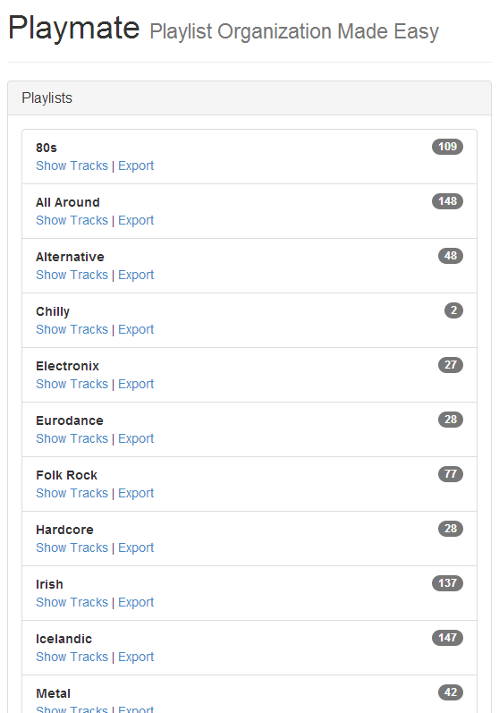

Playmate
========

[](https://opensource.org/licenses/MIT)

Your online playlist companion

This is intended to be a tool for synchronizing playlists across
different online music services.

### Running the Application

To install any missing dependencies, run

```javascript
npm install
```

from the root directory. Afterwards you can start the application by
running

```javascript
node app.js
```

from within the `src` folder. By default the app will listen on port
`8880` and expect your Spotify API credentials to be stored under
`src/credentials/spotify.js` in the format

```javascript
module.exports.CLIENT_ID     = ...
module.exports.CLIENT_SECRET = ...
module.exports.REDIRECT_URI  = 'http://localhost:8880/callback';
```

### What Works

* Logging in to Spotify
* Browsing Spotify playlists
* Downloading Spotify playlists to JSON files

### What Doesn't Work (Yet)

* Uploading Spotify playlists from JSON files
* Deezer integration
* Google Play Music integration

### Screenshots


